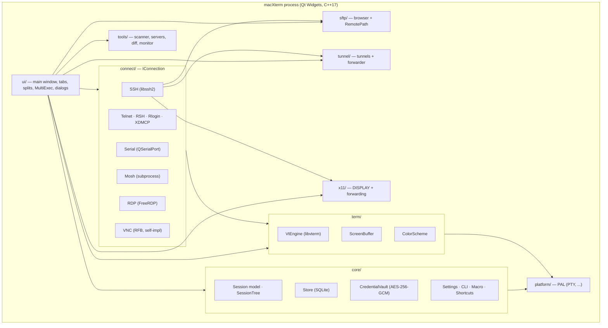
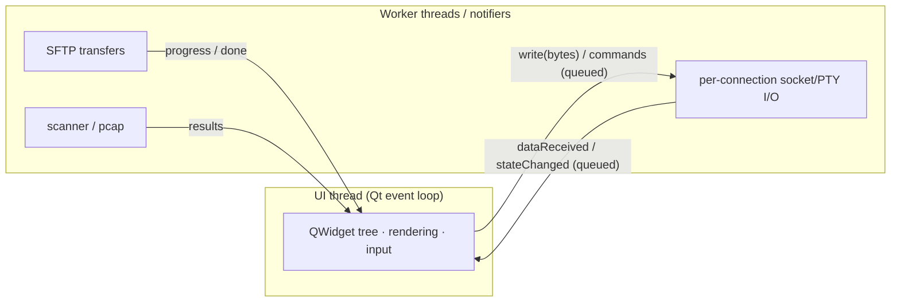
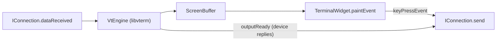
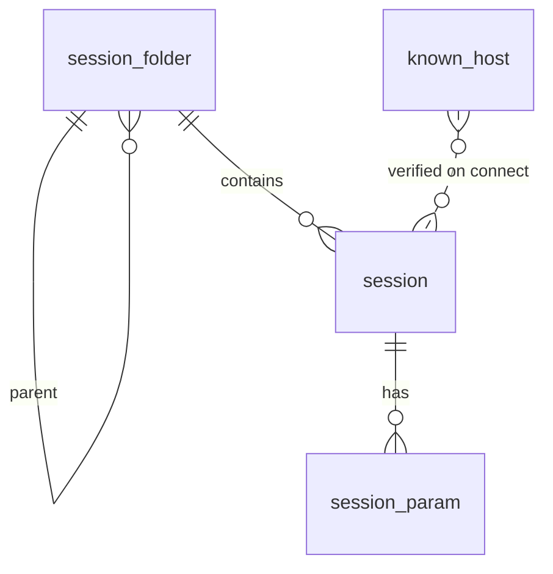

**English** | [中文](DESIGN.zh.md)

# macXterm — Design Document

> **Status:** living document · **Audience:** developers, reviewers, contributors
> **Scope:** the complete technical design of macXterm — a native Qt + C/C++,
> single-process, cross-platform (Windows / macOS / Linux), MIT-licensed clone of
> MobaXterm.

---

## Table of contents

1. [Introduction & goals](#1-introduction--goals)
2. [High-level architecture](#2-high-level-architecture)
3. [Cross-platform strategy (the PAL)](#3-cross-platform-strategy-the-pal)
4. [Threading & concurrency model](#4-threading--concurrency-model)
5. [Module reference](#5-module-reference)
6. [The connection abstraction (`IConnection`)](#6-the-connection-abstraction-iconnection)
7. [Terminal subsystem](#7-terminal-subsystem)
8. [Protocol implementations](#8-protocol-implementations)
9. [SFTP subsystem](#9-sftp-subsystem)
10. [SSH tunnelling](#10-ssh-tunnelling)
11. [X11 forwarding](#11-x11-forwarding)
12. [Built-in tools & light servers](#12-built-in-tools--light-servers)
13. [Data model & persistence](#13-data-model--persistence)
14. [Security design](#14-security-design)
15. [GUI layer](#15-gui-layer)
16. [Build system](#16-build-system)
17. [Testing strategy](#17-testing-strategy)
18. [Licensing](#18-licensing)
19. [Key design decisions (ADRs)](#19-key-design-decisions-adrs)
20. [Implementation status](#20-implementation-status)
21. [Roadmap](#21-roadmap)

---

## 1. Introduction & goals

MobaXterm is a Windows-only, closed-source "remote-computing toolbox": a tabbed
terminal, an embedded X11 server, a graphical SFTP browser, a local Unix
environment, and a pile of network tools, all in a single executable. macXterm
re-creates that value as a **native, open, cross-platform** application.

### Design goals

| # | Goal | Consequence |
|---|------|-------------|
| G1 | **Native, not web** | Qt Widgets + C/C++ compiled to each OS's native binary. No Electron/WebView. |
| G2 | **One codebase, three platforms** | Windows / macOS / Linux from a single source tree; platform differences isolated in a Platform Abstraction Layer (PAL). |
| G3 | **Single-process desktop app** | No client/server split, no backend service, no cloud dependency. All state is local. |
| G4 | **Permissive licensing** | MIT; link only permissive dependencies. No GPL code linked (see §18). |
| G5 | **No artificial limits** | Unlike MobaXterm Home (12 sessions / 2 tunnels / 4 macros / 360-second daemons), macXterm imposes none. |
| G6 | **Feature parity as the north star** | Cover MobaXterm's functional surface: all session types, terminal, SFTP, tunnels, X11, tools. |

### Non-functional targets

| Attribute | Target |
|-----------|--------|
| Cold start to interactive | < 1.5 s |
| Local input → echo latency | < 50 ms |
| Terminal scroll throughput | ≥ 60 fps at 200×50 cells |
| Baseline memory | < 150 MB; < 20 MB per additional SSH tab |
| UI thread | Never performs blocking I/O; no operation freezes the UI > 100 ms |
| Cross-platform | macOS + Linux CI must be green to merge |

---

## 2. High-level architecture

macXterm is a **modular monolith**: a single OS process whose subsystems are
in-process libraries communicating through C++ interfaces and Qt signals/slots.
The UI runs on the main thread; blocking I/O (PTYs, sockets, SFTP transfers) runs
on worker threads and reports back via queued signals.



### Layering rules

- `ui/` may depend on everything below it.
- `connect/`, `sftp/`, `tunnel/`, `x11/`, `tools/`, `term/` depend on `core/` and
  `platform/`, never on `ui/`.
- `core/` and `platform/` depend on nothing above them. This keeps the entire
  non-GUI surface unit-testable without a display.
- All platform `#ifdef`s live in `platform/` (and the guarded branches of
  `connect/`); business modules never branch on the OS.

### Build artifacts

- **`macxterm_core`** — a static library holding every non-GUI module. All test
  binaries link this; the GUI links it too. Because it excludes `ui/`, the whole
  library is testable headless.
- **`macXterm`** — the GUI executable (`ui/` + `macxterm_core` + Qt Widgets).

---

## 3. Cross-platform strategy (the PAL)

MobaXterm assumes Windows (Cygwin userland, `/drives` mounts, registry storage,
a bundled Windows X server). macXterm keeps the source OS-neutral and confines
divergence to a **Platform Abstraction Layer** under `src/platform/`.

| Concern | Windows | macOS | Linux |
|---------|---------|-------|-------|
| Pseudo-terminal | ConPTY (`CreatePseudoConsole`) | `forkpty()` | `forkpty()` |
| SSH transport socket | Winsock | BSD sockets | BSD sockets |
| Filesystem roots | `C:\`, drives | `/Volumes` | `/mnt`, `/media` |
| Credential storage | encrypted vault file (optionally DPAPI) | encrypted vault file (optionally Keychain) | encrypted vault file (optionally libsecret) |
| X server | VcXsrv / bundled | XQuartz | native X.Org / Xwayland |

The credential vault deliberately does **not** bind to any OS keystore by
default — a single portable AES-GCM file works identically everywhere (G2). OS
keystores are an optional future integration behind an `IKeystore` seam.

**Windows specifics.** The ConPTY path in `platform/Pty.cpp` requires Windows 10
RS5-era headers, so the `_WIN32` branch sets `_WIN32_WINNT=0x0A00` and
`NTDDI_VERSION=0x0A000006` before including `<windows.h>`. The same Win32 logic is
mirrored in `scripts/win/conpty_check.cpp`, which cross-compiles to a real PE
binary in CI (job `windows-conpty-crosscompile`) to keep the Windows code honest
without a Windows runner.

---

## 4. Threading & concurrency model



Rules (enforced by review and the "UI never blocks" invariant):

1. The **UI thread never performs blocking I/O**. Socket, PTY, and SFTP work is
   event-driven (via `QSocketNotifier` / `QTcpSocket` readiness) or lives on a
   worker thread.
2. Cross-thread communication uses Qt **queued** signal/slot connections or a
   thread-safe queue. Worker threads never touch `QWidget`s directly.
3. Each connection owns its I/O lifetime; closing a connection tears down its
   notifier/thread deterministically (RAII).

Today most connections are driven on the main thread via non-blocking sockets
and `QSocketNotifier` (fast, no thread overhead); heavy/streaming transfers move
to worker threads as needed.

---

## 5. Module reference

### `core/`

| Class | Responsibility |
|-------|----------------|
| `Session` | A saved connection profile: name, `SessionType`, and a `QVariantMap` of protocol params (host/port/username/keyfile/…), with sensible per-protocol default ports. |
| `SessionType` | Enum of the ten supported session kinds + `Unknown`, with string round-trip. |
| `SessionFolder` | Recursive tree of folders + sessions (the bookmark tree); depth-first lookup and counts. |
| `Store` | SQLite persistence for the session tree, session params, and known-hosts (see §13). `":memory:"` for tests. |
| `CredentialVault` | Encrypted secret store — AES-256-GCM + Argon2id/scrypt (see §14). |
| `Settings` | Global key/value settings with typed accessors (font, scheme, scrollback, X11 options). |
| `IniStore` | Portable INI-style import/export of the session tree. |
| `SshConfigImporter` | Parses OpenSSH `~/.ssh/config` into a `SessionFolder` (Host/HostName/User/Port/IdentityFile/ProxyJump; wildcard hosts skipped). |
| `Macro` | Keystroke record/replay with length-prefixed serialization. |
| `ShortcutRegistry` | Editable action→`QKeySequence` map with defaults and conflict detection. |
| `CliOptions` | Parses `-exec/-newtab/-bookmark/-runmacro/-i/-openfolder/-noX/-hideterm` (value flags support `-flag=value`). |
| `InputBroadcaster` | MultiExec logic decoupled from widgets: register terminal sinks, broadcast to the enabled ones. |
| `SessionForm` | Pure field-map ↔ `Session` mapping + validation, backing the Session dialog. |

### `platform/`

| Class | Responsibility |
|-------|----------------|
| `Pty` | Pseudo-terminal abstraction. Unix: `forkpty` + `QSocketNotifier`. Windows: ConPTY. Emits `readyRead(bytes)` / `finished(code)`; `write`/`resize`/`terminate`. |

### `term/`

| Class | Responsibility |
|-------|----------------|
| `ScreenBuffer` | A rows×cols grid of `Cell` (char + fg/bg/bold/reverse). Resize, clear, row/screen text extraction. |
| `VtEngine` | VT100/VT220/xterm emulation via `libvterm`. Feed bytes → updates `ScreenBuffer`; emits `outputReady` (replies to send back) and `screenUpdated`. |
| `ColorScheme` | 16 ANSI colors + fg/bg. Built-ins: Dark, Light, Solarized Dark; lookup by name. |

### `connect/`

`IConnection` + one class per protocol — see §6 and §8.

### `sftp/`, `tunnel/`, `x11/`, `tools/`, `ui/`

Covered in §9–§12 and §15.

---

## 6. The connection abstraction (`IConnection`)

Every protocol implements one interface so the terminal and UI stay
protocol-agnostic.

```cpp
class IConnection : public QObject {
    enum class State { Disconnected, Connecting, Connected, Failed, Closed };
    struct Capabilities { bool sftp, x11, tunnel, gui; };

    virtual bool   connectSession(const core::Session&) = 0;
    virtual void   disconnectSession() = 0;
    virtual qint64 send(const QByteArray&) = 0;
    virtual void   resize(int cols, int rows);
    virtual Capabilities capabilities() const = 0;

signals:
    void dataReceived(const QByteArray&);           // → VtEngine::input
    void stateChanged(IConnection::State);
    void errorOccurred(const QString&);
};
```

- **Data flow.** Far-end bytes arrive on `dataReceived` and are fed to the tab's
  `VtEngine`; keystrokes captured by `TerminalWidget` go to `send()`.
- **Capabilities** drive the UI: a connection with `sftp=true` gets an SFTP side
  panel; `gui=true` (RDP/VNC) renders its own surface instead of a VT stream and
  no byte stream flows through the terminal.
- **`errorOccurred`** guarantees failures are surfaced, never swallowed (fail
  loud, fail near the source).

`MainWindow::openSession` is the factory that maps a `SessionType` to a concrete
`IConnection`.

---

## 7. Terminal subsystem



- **`VtEngine`** wraps a `VTerm` + `VTermScreen`. On each `input()` it writes
  bytes to libvterm, flushes any generated replies (`outputReady`), then syncs the
  visible cells into `ScreenBuffer`.
- **Non-BMP safety.** `ScreenBuffer::Cell::ch` is a single UTF-16 `QChar`. Code
  points > 0xFFFF (emoji, astral plane) cannot fit and would trip `QChar`'s
  assertion, so `VtEngine` substitutes U+FFFD for them (full astral support would
  widen `Cell` to a `QString` — roadmap). This was a real crash found only by
  running the GUI; it is now covered by a regression test.
- **`TerminalWidget`** renders the `ScreenBuffer` with `QPainter`, maps key events
  to control sequences, recomputes the grid on resize, and participates in
  MultiExec via `InputBroadcaster`.
- **PTY portability.** `ScreenBuffer::resize` uses `QList::fill(value, size)`
  rather than `assign()` (which requires Qt ≥ 6.6) so it builds on the Qt 6.4
  shipped by common Linux distros.

---

## 8. Protocol implementations

| Session type | Implementation | Notes |
|--------------|----------------|-------|
| **Local shell** | `LocalShellConnection` + `Pty` | Runs the user's `$SHELL` in a PTY. macOS/Linux are already Unix, so no Cygwin is bundled. |
| **SSH** | `SshConnection` (`libssh2`) | Non-blocking socket + `QSocketNotifier`; password or public-key auth; PTY + shell channel; optional X11 channel. Same session also carries SFTP / tunnel / X11 channels. |
| **Telnet** | `TelnetConnection` + `TelnetProtocol` | `TelnetProtocol` is a stateless IAC option-negotiation processor (streams across chunks); accepts SGA / server-ECHO, refuses the rest. |
| **Serial** | `SerialConnection` (`QSerialPort`) | `parseConfig()` derives baud/data-bits/parity/stop-bits/flow from session params (default 9600 8N1). |
| **Mosh** | `MoshConnection` | GPL — invoked as a **separate process** (`mosh` binary), never linked. `buildArgs()` composes the argv. |
| **RSH / Rlogin / XDMCP** | `SimpleTcpConnection` (+ `XdmcpConnection`) | Shared TCP-stream client: Rlogin sends the RFC 1282 NUL-delimited handshake, RSH the rcmd handshake, both stripping the leading status-ack byte. XDMCP has its own UDP `XdmcpConnection` state machine (see §8). |
| **FTP** | `FtpClient` (`IRemoteFs`) | Passive-mode FTP browser backend behind the same remote-filesystem interface as SFTP; drives the graphical FTP panel. |
| **RDP** | `RdpConnection` (FreeRDP 3) | Real FreeRDP context: `freerdp_new` → settings → `freerdp_connect` → `gdi_init(BGRA32)`. `currentFrame()` wraps the gdi framebuffer as an ARGB `QImage`; `poll()` pumps the FreeRDP event loop. Built only when FreeRDP is present (`MACXTERM_HAVE_FREERDP`), otherwise a scaffold. |
| **VNC** | `VncConnection` + `RfbProtocol` | From-scratch **MIT** RFB 3.8 client (no GPL libvncclient). Handshake state machine (Version → Security → SecurityResult → ClientInit → ServerInit) + `FramebufferUpdate` parsing + **Raw / CopyRect / RRE / Hextile / ZRLE** decode to ARGB, plus interactive `PointerEvent`/`KeyEvent` injection. See §8. |

### Telnet IAC negotiation

`TelnetProtocol::process(bytes)` returns `{appData, response}`: it strips IAC
command sequences (handling escaped `0xFF` and partial sequences split across
reads), emits clean application data for the terminal, and produces the required
IAC responses. This pure processor is unit-tested independently of the socket.

### VNC / RFB

`RfbProtocol` provides pure codecs — `parseVersion`/`formatVersion`,
`parseServerInit`, `parseFramebufferUpdate`, and per-encoding decoders for
**Raw, CopyRect, RRE, Hextile, and ZRLE** (`decodeRect` / `decodeZRLERect`) —
all unit-tested with byte-exact fixtures. ZRLE keeps a persistent zlib inflate
stream (`RfbZlibStream`) across rectangles, since the compressed framebuffer
stream is continuous. `VncConnection` advertises the encodings via
`SetEncodings`, drives them over a `QTcpSocket` state machine, and emits
`rectDecoded(...)`, `copyRect(...)`, and `serverReady(...)`; it also injects
`PointerEvent`/`KeyEvent` for interactive mouse+keyboard (view-only aware). It
is validated end-to-end against an in-test mock RFB server, plus the ZRLE
decoder is verified with a symmetric zlib deflater (no live server needed).

### XDMCP

`XdmcpProtocol` encodes/parses the discovery + negotiation packets (Query,
Willing, Request, Accept, plus rejection opcodes), and `XdmcpConnection` drives
the Query→Request→Accept UDP state machine — both unit-tested, including a
loopback "fake display manager" fixture. Redirecting the accepted session to a
local X server for display is deferred (needs a real display manager).

---

## 9. SFTP subsystem

| Class | Responsibility |
|-------|----------------|
| `RemotePath` | POSIX-style remote path helpers (`normalize`/`join`/`parent`/`baseName`). Remote paths are always `/`-separated regardless of the local OS, so `QDir` (local-separator aware) cannot be used. |
| `SftpEntry` | One directory entry: name, size, dir flag, POSIX mode, mtime. `permString()` (`drwxr-xr-x`), human-readable `sizeString()`, and `sortListing()` (dirs first, `..` pinned to top). |
| `SftpConnection` | `libssh2` SFTP over an authenticated SSH session: `list()` (readdir → sorted `SftpEntry` rows), `download()`, `upload()`. |

The SFTP browser shares the SSH transport (Architecture §6.3): the same
authenticated session opens an SFTP channel alongside the shell channel, so no
second login is required.

---

## 10. SSH tunnelling

| Class | Responsibility |
|-------|----------------|
| `Tunnel` | A tunnel spec: kind (Local/Remote/Dynamic), bind addr/port, target host/port, validity check. |
| `TunnelManager` | Owns a set of tunnels; rejects invalid specs and bind-port collisions. |
| `TunnelForm` | Pure field-map ↔ `Tunnel` mapping + validation, backing the Tunnel dialog. |
| `LocalForwarder` | The data path for a local tunnel: listens on `bind:port` and relays bytes to `target:port`. In production the target leg is an SSH `direct-tcpip` channel; the plumbing is identical, so it is verified end-to-end over loopback against an echo server. |

Three tunnel kinds mirror OpenSSH: **local** (`-L`), **remote** (`-R`), and
**dynamic** SOCKS (`-D`). Jump-host chaining is modelled as a `jumphost` session
param.

---

## 11. X11 forwarding

macXterm does **not** implement an X server — that is tens of thousands of lines
of third-party engineering. Instead it **integrates the platform's X.Org**
(XQuartz on macOS, VcXsrv on Windows, native on Linux) and manages the forwarding.

`x11/X11Display` provides pure `DISPLAY` handling — `parse("host:disp.screen")`,
`format()`, `forwardingDisplay(channel)` (e.g. channel 0 → `localhost:10.0`), and
`serverAvailable()`. `SshConnection` requests an X11 channel when the session
enables forwarding; the decoded `DISPLAY` is handed to the remote app.

---

## 12. Built-in tools & light servers

| Tool | Class(es) | Notes |
|------|-----------|-------|
| Port scanner | `PortScanner` | TCP-connect scan; sync `scanPort()` + async `scanRange()` emitting `portOpen`. Verified against a loopback listener. |
| Remote monitor | `RemoteMonitor` | Parses `/proc/meminfo` and `/proc/stat` output (run over SSH) into CPU%/RAM usage. Pure parsers, unit-tested. |
| TFTP server | `TftpPacket` + `TftpServer` | RFC 1350 read-only server over UDP (RRQ → DATA/ACK). Verified over loopback. No 360-second cap (G5). |
| FTP server | `FtpCommand` + `FtpServer` | RFC 959 control-channel subset (USER/PASS/PWD/SYST/TYPE/QUIT) over TCP. Verified over loopback. |
| HTTP server | `HttpServer` | Minimal GET file server with path-traversal confinement. Verified over loopback. |
| Text diff | `TextDiff` | LCS line diff (added/removed/equal) — MobaTextDiff parity. |
| Host-key fingerprint | `HostKey` | OpenSSH-style `SHA256:<base64>` fingerprint for known-hosts verification. |

---

## 13. Data model & persistence

Two on-disk stores, deliberately separated so a leak of one is not a leak of the
other:

1. **`macxterm.db` (SQLite)** — everything **non-secret**.
2. **`vault.bin`** — the AES-256-GCM encrypted secret blob (§14). SQLite rows
   reference secrets by a `vault_ref` key; the database never holds plaintext.

### SQLite schema (implemented in `core/Store`)

```sql
PRAGMA foreign_keys = ON;

CREATE TABLE schema_version (version INTEGER NOT NULL);

CREATE TABLE session_folder (
    id        INTEGER PRIMARY KEY,
    parent_id INTEGER REFERENCES session_folder(id) ON DELETE CASCADE,
    name      TEXT NOT NULL);

CREATE TABLE session (
    id        INTEGER PRIMARY KEY,
    folder_id INTEGER NOT NULL REFERENCES session_folder(id) ON DELETE CASCADE,
    name      TEXT NOT NULL,
    type      TEXT NOT NULL,      -- SSH/Telnet/Serial/RDP/VNC/...
    host      TEXT, port INTEGER, username TEXT,
    vault_ref TEXT);             -- reference into the vault, never a plaintext secret

CREATE TABLE session_param (      -- protocol params as key/value (queryable)
    session_id INTEGER NOT NULL REFERENCES session(id) ON DELETE CASCADE,
    key   TEXT NOT NULL, value TEXT,
    PRIMARY KEY(session_id, key));

CREATE TABLE known_host (         -- host-key pinning
    id INTEGER PRIMARY KEY,
    host TEXT NOT NULL, port INTEGER NOT NULL DEFAULT 22,
    key_type TEXT NOT NULL, fingerprint TEXT NOT NULL,
    UNIQUE(host, port, key_type));
```



**Modelling choices.** Session params use a key/value child table (not a JSON
column) to mirror the C++ `QVariantMap` and stay queryable and migration-friendly.
`schema_version` supports additive migrations.

**Imports.** OpenSSH `~/.ssh/config` import is implemented (`SshConfigImporter`);
PuTTY (registry sessions), WinSCP, and MobaXterm.ini importers are planned and
map onto the same tables. Any plaintext passwords found during import are moved
into the vault and referenced by `vault_ref`.

### Vault blob format

```
magic[8]="MXVAULT1" | kdf_id[1] | salt[16] | nonce[12] | tag[16] | ciphertext[...]
plaintext (pre-encryption) = "id\tsecret\n" repeated
```

`kdf_id` (1 = Argon2id, 2 = scrypt) is stored so a vault written by one build
decrypts correctly on another regardless of which KDF that build had (see §14).

---

## 14. Security design

| Area | Design |
|------|--------|
| Vault encryption | **AES-256-GCM** (authenticated). The 12-byte nonce is random per write; the GCM tag makes tampering detectable — decrypt fails if any byte changes. |
| Key derivation | **Argon2id** (`t=3, m=64 MiB, p=1`) via OpenSSL 3.2+ `EVP_KDF`; **scrypt** (`N=16384, r=8, p=1`) fallback on OpenSSL 3.0/3.1. The KDF id is stored in the blob for portability. |
| Master password | Required to unlock; on creation the dialog enforces a match and ≥ 8 chars. |
| Memory hygiene | Derived keys and decrypted plaintext buffers are wiped with `OPENSSL_cleanse` after use. |
| Host keys | Connections verify the server's `SHA256:` fingerprint against the pinned `known_host` row; a changed key requires explicit user decision (no silent trust-on-change). |
| Secret separation | Secrets live only in the vault; SQLite holds references. A leaked database exposes no passwords. |
| No plaintext leaks | The vault ciphertext is asserted (in tests) not to contain plaintext; logs never print passwords/keys. |
| File permissions | Vault and settings files are created for the owning user only (0600-equivalent). |

Verified behaviours (unit tests): wrong master password rejected, GCM tamper
detected, ciphertext ≠ plaintext, key material wiped, round-trip across
Argon2id/scrypt builds.

---

## 15. GUI layer

| Widget / dialog | Role |
|-----------------|------|
| `MainWindow` | Session-tree dock (`QTreeWidget`), tabbed terminal area (`QTabWidget`), toolbar (New Shell / New Session / MultiExec / Tunnel / Settings / Vault), and the `SessionType` → `IConnection` factory. |
| `TerminalWidget` | Renders a `VtEngine`'s `ScreenBuffer`, forwards input, participates in MultiExec. |
| `SessionDialog` | Create/edit a session; thin over `core::SessionForm` (validation lives there and is tested). |
| `TunnelDialog` | Create a tunnel; thin over `tunnel::TunnelForm`. |
| `SettingsDialog` | Terminal / X11 setting tabs over `core::Settings`. |
| `VaultDialog` | Master-password create/unlock; the create/unlock validation rule is a static, tested helper. |
| `RdpSurfaceWidget` | Framebuffer render surface for RDP/VNC — holds a `QImage`, blits scaled, applies sub-rectangle updates. |

The dialogs are deliberately thin: their field↔model mapping and validation live
in `core::SessionForm` / `tunnel::TunnelForm` / `VaultDialog::validate`, which are
pure and unit-tested, so GUI code carries no untested logic.

---

## 16. Build system

CMake (≥ 3.21). Two targets: the `macxterm_core` static library and the
`macXterm` GUI executable, plus the CTest suite.

### Dependencies

| Dependency | Purpose | License | Linkage |
|------------|---------|---------|---------|
| Qt 6 (Core/Gui/Widgets/Network/SerialPort/Sql/Test) | UI, event loop, sockets, serial, SQLite, tests | LGPL-3.0 | **dynamic only** |
| OpenSSL 3 | AES-256-GCM + Argon2id/scrypt | Apache-2.0 | dynamic |
| `libvterm` | terminal emulation | MIT | dynamic |
| `libssh2` | SSH / SFTP / tunnels | BSD-3 | dynamic |
| `zlib` | VNC ZRLE inflate | zlib | dynamic |
| FreeRDP 3 | real RDP (optional) | Apache-2.0 | dynamic, autodetected |
| `libpcap` | packet capture (optional) | BSD | dynamic, autodetected |

Argon2 comes from OpenSSL's `EVP_KDF` — there is **no** separate `argon2`
dependency. Qt is linked **dynamically** to satisfy LGPL under an MIT project;
static-linking Qt would require a commercial license and is not done.

### Options

| CMake option | Default | Meaning |
|--------------|---------|---------|
| `MACXTERM_BUILD_GUI` | ON | Build the GUI executable |
| `MACXTERM_BUILD_TESTS` | ON | Build the CTest suite |
| `MACXTERM_HAVE_FREERDP` | auto | Defined when FreeRDP is found → real RDP |

Cross-platform robustness lessons already baked in: `OPENSSL_ROOT_DIR` is pinned
to Homebrew only on macOS; the scrypt KDF fallback handles OpenSSL 3.0; `fill()`
replaces `assign()` for Qt 6.4; the `openpty` header differs (`<util.h>` on
macOS/BSD, `<pty.h>` on Linux). See `docs/BUILD.md` for per-platform setup.

---

## 17. Testing strategy

A desktop test pyramid wired into CTest:

| Level | How | Examples |
|-------|-----|----------|
| **Unit** | `QTEST_APPLESS_MAIN`, pure logic | session model, vault crypto, VT engine, IAC negotiation, RFB codecs, tunnels, diff, path/host-key helpers |
| **Integration (in-process)** | `QTEST_GUILESS_MAIN` + real PTY/loopback | local shell over `forkpty`, serial over a real pty pair, port scanner, tunnel forwarder |
| **Mock-server e2e** | in-test fixture servers over loopback | VNC vs. a mock RFB server, Telnet vs. a mock IAC server, HTTP/FTP/TFTP servers, FTP browser vs. an embedded FTP server, XDMCP vs. a loopback "fake display manager" |
| **Symmetric codec** | encode with the same library the decoder reverses | VNC **ZRLE** decoded against tile data compressed by zlib `deflate` (no live server) |
| **Guarded-live e2e** | real servers deployed by scripts; `QSKIP` when absent | SSH vs. a real `sshd` (`scripts/live-sshd.sh`), RDP vs. `sfreerdp-server` (`scripts/rdp-fixture.sh`) |

Discipline: guarded-live tests `QSKIP` with a reason when no endpoint is
configured, so "unavailable" never reads as "passed". Cross-platform builds are
validated on macOS and via a real Ubuntu container (`scripts/linux-build.sh`); the
CI matrix (`.github/workflows/ci.yml`) covers Windows/macOS/Linux plus a MinGW
Windows cross-compile and a Dockerized live-SSH job.

Current suite: **71 test binaries, 100% green on macOS and Linux.**

---

## 18. Licensing

macXterm is **MIT**. The dependency policy is: link only permissive licenses;
never link GPL.

- **Qt** — LGPL, satisfied by dynamic linking.
- **libssh2 / libvterm / OpenSSL / FreeRDP** — BSD / MIT / Apache, all permissive.
- **VNC** — GPL `libvncclient` is *excluded*; RFB is re-implemented from scratch
  under MIT.
- **Mosh** — GPL; invoked as a **separate process**, never linked, so no copyleft
  reaches macXterm.
- **Text editor / diff** — no GPL `QScintilla`; built on Qt's own widgets + an
  MIT LCS diff.

A gate for new dependencies: anything GPL/AGPL is rejected unless it can be
isolated behind a process boundary without shipping its binary.

---

## 19. Key design decisions (ADRs)

| Decision | Choice | Rationale |
|----------|--------|-----------|
| Delivery shape | Native Qt Widgets, single process | Native performance and a single binary (G1, G3); not Electron. |
| X11 | Integrate the platform X server, don't implement one | An X server is out-of-scope third-party engineering; integration is tractable and cross-platform. |
| Licensing | MIT + permissive-only, GPL isolated by process | Maximum reuse/redistribution freedom (G4). |
| VNC | Self-implement RFB (MIT) | Avoid GPL `libvncclient` while keeping VNC. |
| RDP | FreeRDP (Apache), optional at build time | T.128 is impractical to re-implement; FreeRDP is permissive. |
| Credential store | Portable AES-GCM file, OS keystore optional | Cross-platform parity without binding to any one OS keystore (G2). |
| KDF | Argon2id, scrypt fallback, id stored in blob | Argon2 needs OpenSSL 3.2+; scrypt keeps older distros working while vaults stay portable. |
| Persistence | SQLite for non-secrets, separate encrypted vault | Queryable session tree; secrets physically isolated. |

---

## 20. Implementation status

macXterm builds and passes its **full 71-suite test set** on macOS and Linux
(`ctest --test-dir build`). Feature depth by area:

**Fully implemented, tested, and runnable**
- Terminal (libvterm VT engine, screen buffer, colour schemes), 256-color + **true-color**, **astral-plane / emoji glyphs**, **CJK input-method (IME) typing**, syntax highlighting, session logging, bracketed paste, mouse reporting (1000/1002/1003 + SGR 1006), scrollback search, `Ctrl`/`Cmd`-click URL open, resize reflow.
- Tabbed UI with drag-reorder, detach/reattach, **2/2/4 split panes**, MultiExec broadcast, and an **in-window menu bar** (macOS `setNativeMenuBar(false)`).
- Per-session terminal overrides (font / scheme / scrollback / Backspace) layered over global settings.
- Local shell over a PTY; SSH (libssh2) incl. a live end-to-end test against a real `sshd`; SSH keepalive, remote-command, stay-open, jump host, agent, X11 forwarding, compression.
- Telnet (mock-server e2e), **RSH/Rlogin** (real rcmd/RFC-1282 handshake + status-ack), Serial (real pty pair), Mosh (subprocess arg build with UDP port-range + predict).
- **VNC** — from-scratch RFB 3.8 client with Raw / CopyRect / RRE / Hextile / **ZRLE** decoding and interactive mouse+keyboard input; end-to-end against a mock and real server.
- **RDP** — real FreeRDP connect + TLS handshake + GDI framebuffer + interactive input + resolution/redirection flags, end-to-end against `sfreerdp-server`.
- **XDMCP** — Query→Willing→Request→Accept handshake codec + UDP state machine (loopback-tested; see below for the display-redirection gap).
- Graphical **SFTP & FTP browsers** — drag-and-drop, follow-terminal-folder, remote edit-and-resave, recursive folder transfer with cancelable progress, date column / sort / Home.
- Credential vault (AES-GCM + Argon2id/scrypt), SQLite store + known-hosts, **folder/icon session tree** with a live name/host/user/folder filter and a right-click edit menu (rename/move/duplicate/set-icon/folder ops — pure `core::` predicates: `sessionMatchesFilter`, `renameSessionInList`, `moveSessionToFolder`, `renameFolderInList`, `uniqueCopyName`), `ssh_config` & `MobaXterm.ini` import.
- SSH tunnels — local/remote/**dynamic (SOCKS)** (loopback e2e) + jump-host routing for RDP/VNC; macros, shortcuts, CLI parsing.
- Built-in servers: TFTP / HTTP / FTP / Telnet / CRON / **NFSv3 (read/write)** / SSH·SFTP (all tested over loopback / with fixtures).
- Tools: port scanner, subnet sweep, **packet capture (libpcap)**, keygen, image viewer, text & folder diff, remote CPU/RAM monitor.
- Embedded **Browser** session (QWebEngineView).

**Implemented in-source; validated further with live infrastructure**
- SSH channels' live SFTP/tunnel wiring against production servers.

**Deferred — needs external infrastructure to verify end-to-end**
- **XDMCP display redirection**: the handshake reaches `Accept` (with a session id);
  launching a local X server to render the remote desktop after that needs a real
  display manager and is not yet wired.
- **VNC Tight encoding** (another zlib-based codec; ZRLE already covers most servers).
- **X11 server *bundling*** for turnkey forwarding — macXterm integrates a
  user-provided X server (XQuartz / VcXsrv) instead of shipping X.Org.
- **Windows ConPTY local shell** — the `_WIN32` PTY path is a stub; other subsystems
  build on Windows but the local shell there is incomplete.

**Out of scope (Windows-only)**
- WSL sessions, the Cygwin `/drives`·`/registry`·`cygpath` extensions, the MobApt
  package manager, PuTTY-registry/WinSCP import, and the Windows shell/protocol handlers.

---

## 21. Roadmap

| Phase | Focus |
|-------|-------|
| ✅ Foundation | Terminal core, local shell, SSH, session model, vault, persistence. |
| ✅ SSH ecosystem | SFTP/FTP browsers (drag-drop, follow-folder, edit-and-resave), tunnels, MultiExec, imports. |
| ✅ Multi-protocol | Telnet, Serial, Mosh, RSH/Rlogin (real handshakes), XDMCP (handshake), VNC (Raw→ZRLE), RDP. |
| ✅ Tools & servers | Scanner, subnet, packet capture, TFTP/HTTP/FTP/Telnet/CRON/NFS/SSH servers, diff, monitor, keygen. |
| ✅ Terminal & UI polish | Split panes, detachable tabs, per-session settings, folders/icons, in-window menu, true-color, astral glyphs, IME, mouse reporting, scrollback search. |
| ▢ Remaining protocol depth | XDMCP display redirection, VNC Tight; bundled X server; Windows ConPTY shell. |
| ▢ Packaging | Signed/notarized installers per platform; auto-update. |

---

*See also: [README.md](../README.md), [docs/BUILD.md](BUILD.md),
[docs/USER_GUIDE.md](USER_GUIDE.md).*
