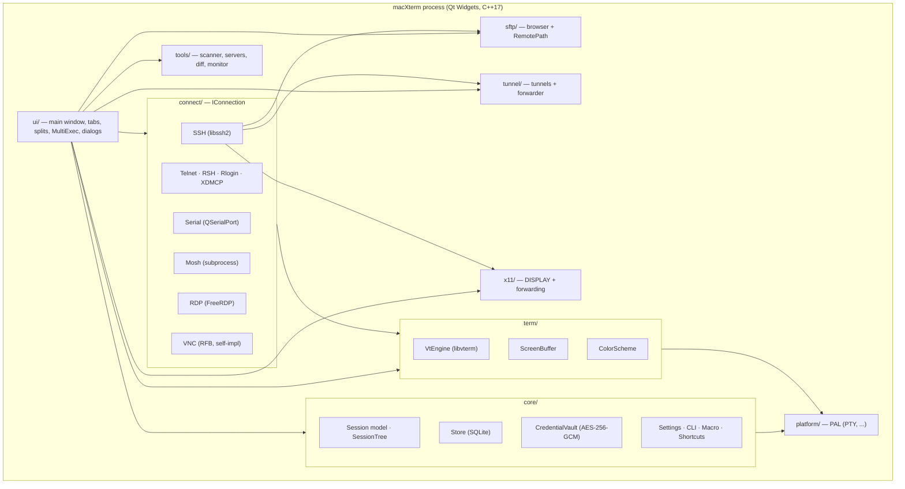
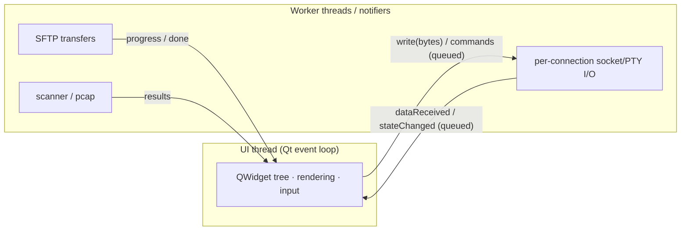
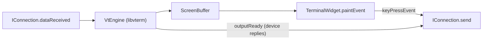
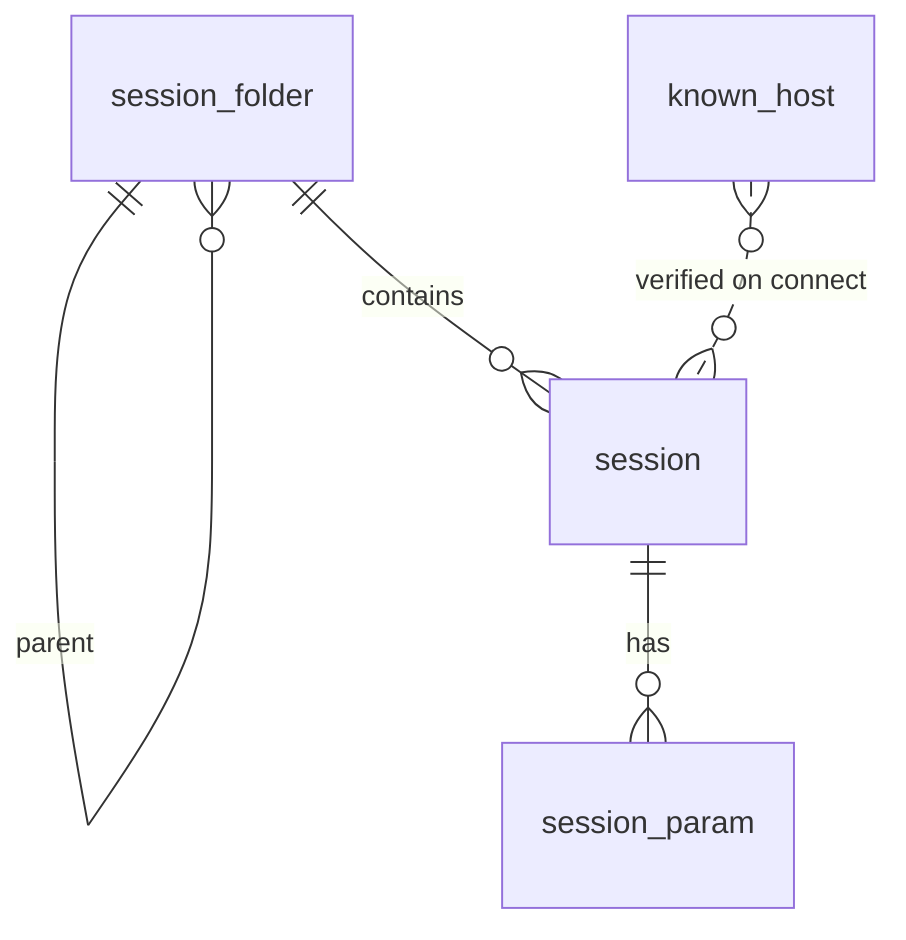

[English](DESIGN.md) | **中文**

# macXterm — 設計文件

> **狀態：** 持續更新文件 · **讀者對象：** 開發者、審查者、貢獻者
> **範疇：** macXterm 的完整技術設計——一個原生 Qt + C/C++、單一行程、跨平台
> （Windows / macOS / Linux）、MIT 授權的 MobaXterm 仿製品。

---

## 目錄

1. [簡介與目標](#1-introduction--goals)
2. [高層架構](#2-high-level-architecture)
3. [跨平台策略（PAL）](#3-cross-platform-strategy-the-pal)
4. [執行緒與並行模型](#4-threading--concurrency-model)
5. [模組參考](#5-module-reference)
6. [連線抽象（`IConnection`）](#6-the-connection-abstraction-iconnection)
7. [終端子系統](#7-terminal-subsystem)
8. [協定實作](#8-protocol-implementations)
9. [SFTP 子系統](#9-sftp-subsystem)
10. [SSH 通道（tunnelling）](#10-ssh-tunnelling)
11. [X11 轉發](#11-x11-forwarding)
12. [內建工具與輕量伺服器](#12-built-in-tools--light-servers)
13. [資料模型與持久化](#13-data-model--persistence)
14. [安全設計](#14-security-design)
15. [GUI 層](#15-gui-layer)
16. [建置系統](#16-build-system)
17. [測試策略](#17-testing-strategy)
18. [授權](#18-licensing)
19. [關鍵設計決策（ADR）](#19-key-design-decisions-adrs)
20. [實作現況](#20-implementation-status)
21. [路線圖](#21-roadmap)

---

## 1. 簡介與目標

MobaXterm 是一款僅支援 Windows、閉源的「遠端運算工具箱」：分頁式終端機、內嵌
X11 伺服器、圖形化 SFTP 瀏覽器、本地 Unix 環境，以及一大堆網路工具，全部包在
單一執行檔中。macXterm 以**原生、開放、跨平台**的方式重現這些價值。

### 設計目標

| # | 目標 | 結果 |
|---|------|-------------|
| G1 | **原生，非網頁技術** | Qt Widgets + C/C++ 編譯成各作業系統的原生執行檔，不使用 Electron/WebView。 |
| G2 | **一份原始碼，三個平台** | Windows / macOS / Linux 共用同一份原始碼樹；平台差異隔離在 Platform Abstraction Layer（PAL）中。 |
| G3 | **單一行程的桌面應用程式** | 沒有 client/server 分離、沒有後端服務、不依賴雲端。所有狀態都保存在本機。 |
| G4 | **寬鬆授權** | MIT；僅連結寬鬆授權的相依套件，不連結任何 GPL 程式碼（見 §18）。 |
| G5 | **不設人為限制** | 不同於 MobaXterm Home（12 個 session / 2 條通道 / 4 個巨集 / 360 秒守護行程上限），macXterm 完全不設限。 |
| G6 | **功能對等為北極星** | 涵蓋 MobaXterm 的功能範疇：所有 session 類型、終端機、SFTP、通道、X11、工具。 |

### 非功能性目標

| 屬性 | 目標值 |
|-----------|--------|
| 冷啟動至可互動 | < 1.5 秒 |
| 本地輸入 → 回顯延遲 | < 50 毫秒 |
| 終端機捲動吞吐量 | 在 200×50 字元下 ≥ 60 fps |
| 基準記憶體用量 | < 150 MB；每多開一個 SSH 分頁 < 20 MB |
| UI 執行緒 | 絕不執行阻塞式 I/O；任何操作都不得讓 UI 凍結超過 100 毫秒 |
| 跨平台 | macOS + Linux CI 必須綠燈才能合併 |

---

## 2. 高層架構

macXterm 是一個**模組化單體（modular monolith）**：單一作業系統行程，其中的子系統
是以行程內函式庫的形式存在，透過 C++ 介面與 Qt signal/slot 溝通。UI 執行於主執行緒；
阻塞式 I/O（PTY、socket、SFTP 傳輸）執行於工作執行緒，並透過佇列化 signal 回報結果。



### 分層規則

- `ui/` 可以依賴其下的所有模組。
- `connect/`、`sftp/`、`tunnel/`、`x11/`、`tools/`、`term/` 只依賴 `core/` 和
  `platform/`，絕不依賴 `ui/`。
- `core/` 和 `platform/` 不依賴任何在它們之上的模組。這讓整個非 GUI 的部分
  可以在沒有顯示器的情況下做單元測試。
- 所有平台相關的 `#ifdef` 都放在 `platform/`（以及 `connect/` 中被保護的分支）；
  業務模組絕不因作業系統而分支。

### 建置產物

- **`macxterm_core`** — 一個靜態函式庫，收納所有非 GUI 模組。所有測試執行檔
  都連結它；GUI 也連結它。由於它不包含 `ui/`，整個函式庫可以無頭（headless）測試。
- **`macXterm`** — GUI 執行檔（`ui/` + `macxterm_core` + Qt Widgets）。

---

## 3. 跨平台策略（PAL）

MobaXterm 假設在 Windows 環境下運作（Cygwin 使用者空間、`/drives` 掛載點、
登錄檔儲存、內建的 Windows X server）。macXterm 讓原始碼保持作業系統中立，
把差異限制在 `src/platform/` 下的 **Platform Abstraction Layer** 中。

| 關注點 | Windows | macOS | Linux |
|---------|---------|-------|-------|
| 虛擬終端機 | ConPTY（`CreatePseudoConsole`） | `forkpty()` | `forkpty()` |
| SSH 傳輸 socket | Winsock | BSD sockets | BSD sockets |
| 檔案系統根目錄 | `C:\`、磁碟機代號 | `/Volumes` | `/mnt`、`/media` |
| 憑證儲存 | 加密保管庫檔案（可選 DPAPI） | 加密保管庫檔案（可選 Keychain） | 加密保管庫檔案（可選 libsecret） |
| X server | VcXsrv / 內建 | XQuartz | 原生 X.Org / Xwayland |

憑證保管庫刻意**不**預設綁定任何作業系統的金鑰庫——單一可攜的 AES-GCM
檔案在各平台上運作方式完全相同（G2）。作業系統金鑰庫是未來可選的整合項目，
會透過 `IKeystore` 介面銜接。

**Windows 特有事項。** `platform/Pty.cpp` 中的 ConPTY 路徑需要 Windows 10
RS5 時期的標頭檔，因此 `_WIN32` 分支在 include `<windows.h>` 之前會設定
`_WIN32_WINNT=0x0A00` 和 `NTDDI_VERSION=0x0A000006`。同樣的 Win32 邏輯也複製了
一份到 `scripts/win/conpty_check.cpp`，它會在 CI（job `windows-conpty-crosscompile`）
中跨平台編譯成真正的 PE 執行檔，在沒有 Windows runner 的情況下確保 Windows
程式碼是正確的。

---

## 4. 執行緒與並行模型



規則（由程式碼審查與「UI 絕不阻塞」不變式強制執行）：

1. **UI 執行緒絕不執行阻塞式 I/O。** Socket、PTY 與 SFTP 的工作要嘛是事件驅動
   （透過 `QSocketNotifier` / `QTcpSocket` 的就緒通知），要嘛放在工作執行緒上。
2. 跨執行緒通訊使用 Qt 的**佇列化（queued）** signal/slot 連線，或是執行緒安全
   的佇列。工作執行緒絕不直接碰觸 `QWidget`。
3. 每個連線擁有自己的 I/O 生命週期；關閉連線時會確定性地（透過 RAII）拆除
   其 notifier / 執行緒。

目前大多數連線是透過非阻塞式 socket 與 `QSocketNotifier` 在主執行緒上驅動的
（速度快、無執行緒額外負擔）；需要時，大量／串流式傳輸會移到工作執行緒上進行。

---

## 5. 模組參考

### `core/`

| 類別 | 職責 |
|-------|----------------|
| `Session` | 一個已儲存的連線設定檔：名稱、`SessionType`，以及一個包含協定參數（host/port/username/keyfile/…）的 `QVariantMap`，並帶有各協定合理的預設埠號。 |
| `SessionType` | 十種支援的 session 種類加上 `Unknown` 的列舉，具備字串雙向轉換。 |
| `SessionFolder` | 遞迴式的資料夾 + session 樹（書籤樹）；支援深度優先查詢與計數。 |
| `Store` | Session 樹、session 參數、known-hosts 的 SQLite 持久化（見 §13）。測試時用 `":memory:"`。 |
| `CredentialVault` | 加密的機密儲存區——AES-256-GCM + Argon2id/scrypt（見 §14）。 |
| `Settings` | 全域鍵值設定，具型別存取器（字型、配色方案、捲動緩衝、X11 選項）。 |
| `IniStore` | 可攜式的 INI 格式 session 樹匯入／匯出。 |
| `SshConfigImporter` | 解析 OpenSSH 的 `~/.ssh/config` 成為 `SessionFolder`（Host/HostName/User/Port/IdentityFile/ProxyJump；萬用字元 host 會被跳過）。 |
| `Macro` | 按鍵錄製／重播，使用長度前綴序列化。 |
| `ShortcutRegistry` | 可編輯的動作→`QKeySequence` 對照表，含預設值與衝突偵測。 |
| `CliOptions` | 解析 `-exec/-newtab/-bookmark/-runmacro/-i/-openfolder/-noX/-hideterm`（值旗標支援 `-flag=value`）。 |
| `InputBroadcaster` | 與 widget 解耦的 MultiExec 邏輯：註冊終端機接收端，廣播給已啟用的接收端。 |
| `SessionForm` | 純粹的欄位對照 ↔ `Session` 對照 + 驗證，支撐 Session 對話框。 |

### `platform/`

| 類別 | 職責 |
|-------|----------------|
| `Pty` | 虛擬終端機抽象層。Unix：`forkpty` + `QSocketNotifier`。Windows：ConPTY。發出 `readyRead(bytes)` / `finished(code)`；提供 `write`/`resize`/`terminate`。 |

### `term/`

| 類別 | 職責 |
|-------|----------------|
| `ScreenBuffer` | 由 `Cell`（字元 + 前景/背景色/粗體/反白）組成的 rows×cols 網格。支援縮放、清除、單行／整屏文字擷取。 |
| `VtEngine` | 透過 `libvterm` 實作 VT100/VT220/xterm 模擬。餵入位元組 → 更新 `ScreenBuffer`；發出 `outputReady`（要回傳的回應）與 `screenUpdated`。 |
| `ColorScheme` | 16 種 ANSI 色 + 前景/背景色。內建：Dark、Light、Solarized Dark；可依名稱查詢。 |

### `connect/`

`IConnection` 加上每個協定各自一個類別——見 §6 與 §8。

### `sftp/`、`tunnel/`、`x11/`、`tools/`、`ui/`

涵蓋於 §9–§12 與 §15。

---

## 6. 連線抽象（`IConnection`）

每個協定都實作同一個介面，讓終端機與 UI 保持與協定無關。

```cpp
class IConnection : public QObject {
    enum class State { Disconnected, Connecting, Connected, Failed, Closed };
    struct Capabilities { bool sftp, x11, tunnel, gui; };

    virtual bool   connectSession(const core::Session&) = 0;
    virtual void   disconnectSession() = 0;
    virtual qint64 send(const QByteArray&) = 0;
    virtual void   resize(int cols, int rows);
    virtual Capabilities capabilities() const = 0;

signals:
    void dataReceived(const QByteArray&);           // → VtEngine::input
    void stateChanged(IConnection::State);
    void errorOccurred(const QString&);
};
```

- **資料流。** 遠端傳來的位元組會透過 `dataReceived` 送達，並餵給該分頁的
  `VtEngine`；`TerminalWidget` 擷取到的按鍵則送往 `send()`。
- **Capabilities** 決定 UI 的樣貌：`sftp=true` 的連線會得到一個 SFTP 側邊面板；
  `gui=true`（RDP/VNC）則會渲染自己的畫面而非 VT 串流，也不會有位元組流經
  終端機。
- **`errorOccurred`** 保證錯誤一定會被呈現出來，絕不悄悄吞掉（在最靠近錯誤
  來源之處、以最明顯的方式失敗）。

`MainWindow::openSession` 是把 `SessionType` 對應到具體 `IConnection` 的工廠方法。

---

## 7. 終端子系統



- **`VtEngine`** 包裝一個 `VTerm` + `VTermScreen`。每次呼叫 `input()` 時，它會把
  位元組寫入 libvterm，沖刷（flush）任何產生的回應（`outputReady`），再把可見的
  儲存格同步進 `ScreenBuffer`。
- **超出基本多語言平面（Non-BMP）的安全性。** `ScreenBuffer::Cell::ch` 是單一
  UTF-16 的 `QChar`。超過 0xFFFF 的碼點（表情符號、星群平面字元）放不進去，
  會觸發 `QChar` 的斷言，因此 `VtEngine` 會用 U+FFFD 取代它們（要完整支援
  星群平面字元，需把 `Cell` 擴充為 `QString`——列在路線圖中）。這是一個
  只有在實際執行 GUI 時才被發現的真實當機問題，現在已有回歸測試涵蓋。
- **`TerminalWidget`** 用 `QPainter` 渲染 `ScreenBuffer`，把按鍵事件對應到
  控制序列，在縮放時重新計算網格，並透過 `InputBroadcaster` 參與 MultiExec。
- **PTY 可攜性。** `ScreenBuffer::resize` 使用 `QList::fill(value, size)`
  而非 `assign()`（後者需要 Qt ≥ 6.6），以便在常見 Linux 發行版所搭載的
  Qt 6.4 上也能建置。

---

## 8. 協定實作

| Session 類型 | 實作 | 備註 |
|--------------|----------------|-------|
| **本地 shell** | `LocalShellConnection` + `Pty` | 在 PTY 中執行使用者的 `$SHELL`。macOS/Linux 本身已是 Unix，因此不需要內建 Cygwin。 |
| **SSH** | `SshConnection`（`libssh2`） | 非阻塞式 socket + `QSocketNotifier`；密碼或公開金鑰驗證；PTY + shell channel；可選的 X11 channel。同一個 session 也承載 SFTP / 通道 / X11 channel。 |
| **Telnet** | `TelnetConnection` + `TelnetProtocol` | `TelnetProtocol` 是一個無狀態的 IAC 選項協商處理器（可跨多個資料塊串流處理）；接受 SGA / server-ECHO，其餘一律拒絕。 |
| **Serial** | `SerialConnection`（`QSerialPort`） | `parseConfig()` 從 session 參數推導出鮑率／資料位元／同位檢查／停止位元／流量控制（預設 9600 8N1）。 |
| **Mosh** | `MoshConnection` | GPL——以**獨立行程**方式呼叫（`mosh` 執行檔），絕不連結進來。`buildArgs()` 組出 argv。 |
| **RSH / Rlogin / XDMCP** | `SimpleTcpConnection`（+ `XdmcpConnection`） | 共用的 TCP 串流客戶端：Rlogin 送出 RFC 1282 以 NUL 分隔的交握，RSH 送出 rcmd 交握，兩者都會剝除開頭的狀態確認位元組。XDMCP 有自己的 UDP `XdmcpConnection` 狀態機（見 §8）。 |
| **FTP** | `FtpClient`（`IRemoteFs`） | 被動模式的 FTP 瀏覽器後端，位於與 SFTP 相同的遠端檔案系統介面之下；驅動圖形化 FTP 面板。 |
| **RDP** | `RdpConnection`（FreeRDP 3） | 真正的 FreeRDP context：`freerdp_new` → 設定 → `freerdp_connect` → `gdi_init(BGRA32)`。`currentFrame()` 把 gdi 畫面緩衝區包裝成 ARGB 的 `QImage`；`poll()` 驅動 FreeRDP 事件迴圈。只有在偵測到 FreeRDP 時才會建置（`MACXTERM_HAVE_FREERDP`），否則為佔位骨架。 |
| **VNC** | `VncConnection` + `RfbProtocol` | 從零打造、**MIT** 授權的 RFB 3.8 客戶端（不使用 GPL 的 libvncclient）。交握狀態機（Version → Security → SecurityResult → ClientInit → ServerInit）+ `FramebufferUpdate` 解析 + **Raw / CopyRect / RRE / Hextile / ZRLE** 解碼成 ARGB，加上互動式 `PointerEvent`/`KeyEvent` 注入。見 §8。 |

### Telnet IAC 協商

`TelnetProtocol::process(bytes)` 回傳 `{appData, response}`：它會剝除 IAC
命令序列（處理跳脫的 `0xFF` 以及跨讀取分割的不完整序列），輸出乾淨的應用層
資料給終端機，並產生所需的 IAC 回應。這個純處理器獨立於 socket 之外做單元測試。

### VNC / RFB

`RfbProtocol` 提供純粹的編解碼——`parseVersion`/`formatVersion`、
`parseServerInit`、`parseFramebufferUpdate`，以及各編碼方式的解碼器
（`decodeRect` / `decodeZRLERect`），涵蓋 **Raw、CopyRect、RRE、Hextile 與
ZRLE**——全部以逐位元組精確的固定測資做單元測試。ZRLE 在多個矩形之間維持一個
持續性的 zlib 解壓縮串流（`RfbZlibStream`），因為壓縮後的畫面緩衝區串流是連續的。
`VncConnection` 透過 `SetEncodings` 宣告所支援的編碼方式，並在 `QTcpSocket`
狀態機上驅動它們，發出 `rectDecoded(...)`、`copyRect(...)` 和
`serverReady(...)`；它也會注入 `PointerEvent`/`KeyEvent` 以支援互動式滑鼠與
鍵盤操作（會意識到 view-only 模式）。此模組透過測試中的模擬 RFB 伺服器做
端到端驗證，ZRLE 解碼器另外用對稱的 zlib deflate 壓縮器做驗證（不需要真實
伺服器）。

### XDMCP

`XdmcpProtocol` 負責編碼／解析發現與協商封包（Query、Willing、Request、
Accept，以及各種拒絕的 opcode），`XdmcpConnection` 則驅動 Query→Request→
Accept 的 UDP 狀態機——兩者都有單元測試，包含一個 loopback 上的「假顯示管理器」
固定測資。把接受的 session 轉導至本地 X server 顯示的功能目前延後
（需要真實的顯示管理器）。

---

## 9. SFTP 子系統

| 類別 | 職責 |
|-------|----------------|
| `RemotePath` | POSIX 風格的遠端路徑輔助函式（`normalize`/`join`/`parent`/`baseName`）。遠端路徑一律用 `/` 分隔，不受本地作業系統影響，因此不能使用（本地分隔符敏感的）`QDir`。 |
| `SftpEntry` | 一筆目錄項目：名稱、大小、目錄旗標、POSIX 權限模式、修改時間。提供 `permString()`（`drwxr-xr-x`）、人類可讀的 `sizeString()`，以及 `sortListing()`（目錄優先，`..` 固定在最上方）。 |
| `SftpConnection` | 在已驗證的 SSH session 上使用 `libssh2` 進行 SFTP：`list()`（readdir → 排序後的 `SftpEntry` 列）、`download()`、`upload()`。 |

SFTP 瀏覽器共用 SSH 傳輸層（見架構 §6.3）：同一個已驗證的 session 會在 shell
channel 之外另開一個 SFTP channel，因此不需要第二次登入。

---

## 10. SSH 通道（tunnelling）

| 類別 | 職責 |
|-------|----------------|
| `Tunnel` | 一個通道規格：種類（Local/Remote/Dynamic）、綁定位址/埠、目標主機/埠、有效性檢查。 |
| `TunnelManager` | 擁有一組通道；拒絕無效的規格與綁定埠號衝突。 |
| `TunnelForm` | 純粹的欄位對照 ↔ `Tunnel` 對照 + 驗證，支撐 Tunnel 對話框。 |
| `LocalForwarder` | 本地通道的資料路徑：在 `bind:port` 上監聽，並把位元組轉送到 `target:port`。在正式環境中，目標端是一條 SSH 的 `direct-tcpip` channel；管線邏輯完全相同，因此已透過 loopback 上對照一個回音伺服器做端到端驗證。 |

三種通道種類對應 OpenSSH 的用法：**local**（`-L`）、**remote**（`-R`）與
**dynamic** SOCKS（`-D`）。跳板主機（jump-host）串接則以 session 參數
`jumphost` 建模。

---

## 11. X11 轉發

macXterm **不**實作 X server——那是數萬行第三方工程。相反地，它會**整合平台
自帶的 X.Org**（macOS 上的 XQuartz、Windows 上的 VcXsrv、Linux 上的原生
X.Org）並管理轉發。

`x11/X11Display` 提供純粹的 `DISPLAY` 處理——`parse("host:disp.screen")`、
`format()`、`forwardingDisplay(channel)`（例如 channel 0 → `localhost:10.0`），
以及 `serverAvailable()`。當 session 啟用轉發時，`SshConnection` 會要求一個
X11 channel；解碼後的 `DISPLAY` 會交給遠端應用程式。

---

## 12. 內建工具與輕量伺服器

| 工具 | 類別 | 備註 |
|------|-----------|-------|
| Port scanner | `PortScanner` | TCP-connect 掃描；同步的 `scanPort()` + 非同步的 `scanRange()`（發出 `portOpen`）。已對照 loopback 監聽器做驗證。 |
| Remote monitor | `RemoteMonitor` | 解析（透過 SSH 執行取得的）`/proc/meminfo` 與 `/proc/stat` 輸出，轉換成 CPU%/RAM 使用率。純解析器，有單元測試。 |
| TFTP server | `TftpPacket` + `TftpServer` | RFC 1350 唯讀伺服器，走 UDP（RRQ → DATA/ACK）。已透過 loopback 驗證。無 360 秒上限（G5）。 |
| FTP server | `FtpCommand` + `FtpServer` | RFC 959 控制通道子集（USER/PASS/PWD/SYST/TYPE/QUIT），走 TCP。已透過 loopback 驗證。 |
| HTTP server | `HttpServer` | 極簡的 GET 檔案伺服器，具路徑穿越防護。已透過 loopback 驗證。 |
| Text diff | `TextDiff` | LCS 逐行 diff（新增/刪除/相同）——對等於 MobaTextDiff。 |
| Host-key fingerprint | `HostKey` | OpenSSH 風格的 `SHA256:<base64>` 指紋，用於 known-hosts 驗證。 |

---

## 13. 資料模型與持久化

刻意分成兩個磁碟儲存區，使其中一個外洩不代表另一個也外洩：

1. **`macxterm.db`（SQLite）** — 所有**非機密**資料。
2. **`vault.bin`** — AES-256-GCM 加密的機密資料塊（見 §14）。SQLite 資料列
   透過 `vault_ref` 鍵參照機密資料；資料庫本身絕不存放明文。

### SQLite schema（實作於 `core/Store`）

```sql
PRAGMA foreign_keys = ON;

CREATE TABLE schema_version (version INTEGER NOT NULL);

CREATE TABLE session_folder (
    id        INTEGER PRIMARY KEY,
    parent_id INTEGER REFERENCES session_folder(id) ON DELETE CASCADE,
    name      TEXT NOT NULL);

CREATE TABLE session (
    id        INTEGER PRIMARY KEY,
    folder_id INTEGER NOT NULL REFERENCES session_folder(id) ON DELETE CASCADE,
    name      TEXT NOT NULL,
    type      TEXT NOT NULL,      -- SSH/Telnet/Serial/RDP/VNC/...
    host      TEXT, port INTEGER, username TEXT,
    vault_ref TEXT);             -- reference into the vault, never a plaintext secret

CREATE TABLE session_param (      -- protocol params as key/value (queryable)
    session_id INTEGER NOT NULL REFERENCES session(id) ON DELETE CASCADE,
    key   TEXT NOT NULL, value TEXT,
    PRIMARY KEY(session_id, key));

CREATE TABLE known_host (         -- host-key pinning
    id INTEGER PRIMARY KEY,
    host TEXT NOT NULL, port INTEGER NOT NULL DEFAULT 22,
    key_type TEXT NOT NULL, fingerprint TEXT NOT NULL,
    UNIQUE(host, port, key_type));
```



**建模選擇。** Session 參數使用鍵值子表（而非 JSON 欄位），以對映 C++ 的
`QVariantMap`，並保持可查詢性與遷移友善性。`schema_version` 支援附加式（additive）遷移。

**匯入。** OpenSSH 的 `~/.ssh/config` 匯入已經實作（`SshConfigImporter`）；
PuTTY（登錄檔 session）、WinSCP、MobaXterm.ini 的匯入器則已規劃，會對映到
相同的資料表。匯入過程中發現的任何明文密碼，都會被移入保管庫並以
`vault_ref` 參照。

### Vault 資料塊格式

```
magic[8]="MXVAULT1" | kdf_id[1] | salt[16] | nonce[12] | tag[16] | ciphertext[...]
plaintext (pre-encryption) = "id\tsecret\n" repeated
```

`kdf_id`（1 = Argon2id，2 = scrypt）會被儲存起來，讓某個 build 寫入的保管庫
可以在另一個 build 上正確解密，無論該 build 當初用的是哪個 KDF（見 §14）。

---

## 14. 安全設計

| 領域 | 設計 |
|------|--------|
| 保管庫加密 | **AES-256-GCM**（具驗證性）。每次寫入使用隨機的 12 位元組 nonce；GCM 標籤讓竄改可被偵測——只要有任何位元組被更動，解密就會失敗。 |
| 金鑰衍生 | 透過 OpenSSL 3.2+ 的 `EVP_KDF` 使用 **Argon2id**（`t=3, m=64 MiB, p=1`）；在 OpenSSL 3.0/3.1 上退回使用 **scrypt**（`N=16384, r=8, p=1`）。KDF id 會存在資料塊中以確保可攜性。 |
| 主密碼 | 解鎖所需；建立時對話框會強制要求兩次輸入相符，且長度 ≥ 8 字元。 |
| 記憶體衛生 | 衍生出的金鑰與解密後的明文緩衝區，使用後會以 `OPENSSL_cleanse` 清除。 |
| Host key | 連線時會驗證伺服器的 `SHA256:` 指紋是否與釘選的 `known_host` 資料列相符；金鑰若變更，需要使用者明確做出決定（不會默默信任變更）。 |
| 機密隔離 | 機密只存在於保管庫中；SQLite 只存放參照。資料庫外洩不會洩漏任何密碼。 |
| 無明文外洩 | 測試中會斷言保管庫的密文不含明文；日誌絕不印出密碼／金鑰。 |
| 檔案權限 | 保管庫與設定檔案只建立給擁有者本人存取（相當於 0600）。 |

已驗證的行為（單元測試）：錯誤的主密碼會被拒絕、GCM 竄改可被偵測、密文
不等於明文、金鑰材料會被清除、在 Argon2id/scrypt 兩種 build 之間可正確互通。

---

## 15. GUI 層

| Widget / 對話框 | 角色 |
|-----------------|------|
| `MainWindow` | Session 樹的 dock（`QTreeWidget`）、分頁式終端機區域（`QTabWidget`）、工具列（新增 Shell / 新增 Session / MultiExec / Tunnel / Settings / Vault），以及 `SessionType` → `IConnection` 的工廠。 |
| `TerminalWidget` | 渲染 `VtEngine` 的 `ScreenBuffer`、轉發輸入、參與 MultiExec。 |
| `SessionDialog` | 建立／編輯一個 session；只是 `core::SessionForm` 的薄封裝（驗證邏輯放在那裡並有測試）。 |
| `TunnelDialog` | 建立通道；只是 `tunnel::TunnelForm` 的薄封裝。 |
| `SettingsDialog` | 終端機／X11 設定分頁，建立在 `core::Settings` 之上。 |
| `VaultDialog` | 主密碼建立／解鎖；建立／解鎖的驗證規則是一個靜態、有測試的輔助函式。 |
| `RdpSurfaceWidget` | RDP/VNC 的畫面緩衝渲染表面——持有一個 `QImage`，做縮放貼圖，並套用局部矩形更新。 |

這些對話框刻意做得很薄：它們的欄位↔模型對照與驗證邏輯都放在
`core::SessionForm` / `tunnel::TunnelForm` / `VaultDialog::validate` 中，
這些都是純函式且有單元測試，因此 GUI 程式碼本身不帶有未經測試的邏輯。

---

## 16. 建置系統

CMake（≥ 3.21）。兩個目標：`macxterm_core` 靜態函式庫與 `macXterm` GUI
執行檔，外加 CTest 測試套件。

### 相依套件

| 相依套件 | 用途 | 授權 | 連結方式 |
|------------|---------|---------|---------|
| Qt 6（Core/Gui/Widgets/Network/SerialPort/Sql/Test） | UI、事件迴圈、socket、序列埠、SQLite、測試 | LGPL-3.0 | **僅動態連結** |
| OpenSSL 3 | AES-256-GCM + Argon2id/scrypt | Apache-2.0 | 動態連結 |
| `libvterm` | 終端機模擬 | MIT | 動態連結 |
| `libssh2` | SSH / SFTP / 通道 | BSD-3 | 動態連結 |
| `zlib` | VNC ZRLE 解壓縮 | zlib | 動態連結 |
| FreeRDP 3 | 真正的 RDP（可選） | Apache-2.0 | 動態連結，自動偵測 |
| `libpcap` | 封包擷取（可選） | BSD | 動態連結，自動偵測 |

Argon2 來自 OpenSSL 的 `EVP_KDF`——**沒有**額外獨立的 `argon2` 相依套件。
Qt 採**動態**連結以在 MIT 專案中滿足 LGPL 要求；靜態連結 Qt 需要商業授權，
故不採用。

### 選項

| CMake 選項 | 預設值 | 意義 |
|--------------|---------|------|
| `MACXTERM_BUILD_GUI` | ON | 建置 GUI 執行檔 |
| `MACXTERM_BUILD_TESTS` | ON | 建置 CTest 測試套件 |
| `MACXTERM_HAVE_FREERDP` | auto | 找到 FreeRDP 時會被定義 → 啟用真正的 RDP |

已內建的跨平台穩健性經驗：`OPENSSL_ROOT_DIR` 只在 macOS 上釘選為 Homebrew
路徑；scrypt 這條 KDF 後備路徑用來處理 OpenSSL 3.0；`fill()` 取代 `assign()`
以相容 Qt 6.4；`openpty` 標頭檔位置不同（macOS/BSD 是 `<util.h>`，Linux 是
`<pty.h>`）。各平台的建置設定請見 `docs/BUILD.zh.md`。

---

## 17. 測試策略

一個接入 CTest 的桌面測試金字塔：

| 層級 | 方式 | 範例 |
|-------|-----|----------|
| **單元測試** | `QTEST_APPLESS_MAIN`，純邏輯 | session model、保管庫加密、VT engine、IAC 協商、RFB 編解碼、通道、diff、路徑／host-key 輔助函式 |
| **整合測試（行程內）** | `QTEST_GUILESS_MAIN` + 真實 PTY/loopback | 走 `forkpty` 的本地 shell、走真實 pty pair 的序列埠、port scanner、通道轉發器 |
| **模擬伺服器端到端測試** | 測試內的固定測資伺服器，走 loopback | VNC 對照模擬 RFB 伺服器、Telnet 對照模擬 IAC 伺服器、HTTP/FTP/TFTP 伺服器、FTP 瀏覽器對照內嵌 FTP 伺服器、XDMCP 對照 loopback 上的「假顯示管理器」 |
| **對稱式編解碼測試** | 用解碼器所反轉的同一套函式庫做編碼 | VNC **ZRLE** 對照由 zlib `deflate` 壓縮的圖塊資料做解碼驗證（不需要真實伺服器） |
| **有防護的實機端到端測試** | 由腳本部署的真實伺服器；缺席時 `QSKIP` | SSH 對照真實 `sshd`（`scripts/live-sshd.sh`）、RDP 對照 `sfreerdp-server`（`scripts/rdp-fixture.sh`） |

紀律：有防護的實機測試在沒有設定對應端點時會以 `QSKIP` 附上原因跳過，
確保「無法測試」絕不會被誤讀成「測試通過」。跨平台建置在 macOS 與真實的
Ubuntu 容器（`scripts/linux-build.sh`）上都經過驗證；CI matrix
（`.github/workflows/ci.yml`）涵蓋 Windows/macOS/Linux，外加一個 MinGW
Windows 交叉編譯與一個 Docker 化的實機 SSH job。

目前測試套件：**71 個測試執行檔，在 macOS 與 Linux 上 100% 通過。**

---

## 18. 授權

macXterm 採用 **MIT** 授權。相依套件政策是：只連結寬鬆授權，絕不連結 GPL。

- **Qt** — LGPL，透過動態連結滿足。
- **libssh2 / libvterm / OpenSSL / FreeRDP** — BSD / MIT / Apache，皆為寬鬆授權。
- **VNC** — GPL 的 `libvncclient` 被**排除**；RFB 從零以 MIT 授權重新實作。
- **Mosh** — GPL；以**獨立行程**方式呼叫，絕不連結，因此不會有著佐權（copyleft）
  波及 macXterm。
- **文字編輯器 / diff** — 不使用 GPL 的 `QScintilla`；建立在 Qt 自身的
  widget 之上，加上一個 MIT 授權的 LCS diff。

新增相依套件的把關準則：任何 GPL/AGPL 套件都會被拒絕，除非能夠以行程邊界
隔離、且不需要一併發行其執行檔。

---

## 19. 關鍵設計決策（ADR）

| 決策 | 選擇 | 理由 |
|----------|--------|-----------|
| 交付形式 | 原生 Qt Widgets、單一行程 | 原生效能與單一執行檔（G1、G3）；不用 Electron。 |
| X11 | 整合平台的 X server，而非自行實作 | 自行實作 X server 屬於範疇外的龐大第三方工程；整合方案可行且跨平台。 |
| 授權 | MIT + 僅寬鬆授權，GPL 以行程隔離 | 最大化重用／再散布自由（G4）。 |
| VNC | 自行實作 RFB（MIT） | 在保留 VNC 功能的同時避開 GPL 的 `libvncclient`。 |
| RDP | FreeRDP（Apache），建置時可選 | T.128 難以自行重新實作；FreeRDP 屬寬鬆授權。 |
| 憑證儲存 | 可攜式 AES-GCM 檔案，作業系統金鑰庫為可選項 | 跨平台一致性，不綁定於任一作業系統的金鑰庫（G2）。 |
| KDF | Argon2id，退回 scrypt，id 存於資料塊中 | Argon2 需要 OpenSSL 3.2+；scrypt 讓較舊的發行版也能運作，同時保管庫仍保有可攜性。 |
| 持久化 | 非機密用 SQLite，機密另存加密保管庫 | 可查詢的 session 樹；機密資料在實體上被隔離。 |

---

## 20. 實作現況

macXterm 在 macOS 與 Linux 上可以建置並通過**完整的 71 個測試套件**
（`ctest --test-dir build`）。各領域的功能深度如下：

**已完整實作、有測試、可執行**
- 終端機（libvterm VT engine、畫面緩衝區、配色方案）、256 色 + **真彩色**、
  **星群平面／表情符號字元**、**中日韓輸入法（IME）輸入**、語法高亮、
  session 日誌、括號式貼上（bracketed paste）、滑鼠回報（1000/1002/1003 +
  SGR 1006）、捲動緩衝搜尋、`Ctrl`/`Cmd`-點擊開啟網址、縮放重排。
- 具拖曳重新排序、分離／重新附加、**2/2/4 分割視窗**、MultiExec 廣播的分頁式
  UI，以及**視窗內選單列**（macOS 上使用 `setNativeMenuBar(false)`）。
- 每個 session 的終端機覆寫設定（字型／配色方案／捲動緩衝／Backspace），
  疊加在全域設定之上。
- 走 PTY 的本地 shell；SSH（libssh2），含對照真實 `sshd` 的實機端到端測試；
  SSH keepalive、遠端指令、stay-open、跳板主機、agent、X11 轉發、壓縮。
- Telnet（模擬伺服器端到端測試）、**RSH/Rlogin**（真實的 rcmd/RFC-1282
  交握 + 狀態確認）、Serial（真實 pty pair）、Mosh（含 UDP 埠範圍與預測的
  子行程參數組建）。
- **VNC** — 從零打造的 RFB 3.8 客戶端，具 Raw / CopyRect / RRE / Hextile /
  **ZRLE** 解碼與互動式滑鼠鍵盤輸入；已對照模擬與真實伺服器做端到端驗證。
- **RDP** — 真正的 FreeRDP 連線 + TLS 交握 + GDI 畫面緩衝 + 互動式輸入 +
  解析度／重導向旗標，已對照 `sfreerdp-server` 做端到端驗證。
- **XDMCP** — Query→Willing→Request→Accept 交握編解碼 + UDP 狀態機
  （已在 loopback 上測試；顯示轉導方面的缺口見下方）。
- 圖形化 **SFTP 與 FTP 瀏覽器** — 拖放、跟隨終端機所在資料夾、遠端編輯後
  存回、可取消進度的遞迴資料夾傳輸、日期欄位／排序／Home 鍵。
- 憑證保管庫（AES-GCM + Argon2id/scrypt）、SQLite 儲存區 + known-hosts、
  **含資料夾／圖示的 session 樹**，配上即時的名稱／主機／使用者／資料夾篩選
  （純函式 `core::sessionMatchesFilter`）、`ssh_config` 與
  `MobaXterm.ini` 匯入。
- SSH 通道 — local/remote/**dynamic（SOCKS）**（loopback 端到端測試）+
  供 RDP/VNC 使用的跳板主機路由；巨集、快速鍵、CLI 解析。
- 內建伺服器：TFTP / HTTP / FTP / Telnet / CRON / **NFSv3（可讀寫）** /
  SSH·SFTP（皆已在 loopback／固定測資上做過測試）。
- 工具：port scanner、子網掃描、**封包擷取（libpcap）**、金鑰產生器、
  圖片檢視器、文字與資料夾 diff、遠端 CPU/RAM 監控。
- 內嵌的**瀏覽器** session（QWebEngineView）。

**已在原始碼中實作；有待更多實機環境進一步驗證**
- SSH channel 對照正式環境伺服器的實機 SFTP／通道連線邏輯。

**延後——需要外部基礎設施才能做端到端驗證**
- **XDMCP 顯示轉導**：交握流程可以走到帶有 session id 的 `Accept`；
  在那之後啟動本地 X server 來渲染遠端桌面，需要真實的顯示管理器，
  目前尚未接上。
- **VNC Tight 編碼**（另一種基於 zlib 的編碼；ZRLE 已涵蓋大多數伺服器）。
- **X server 的隨附打包**以達成免設定的轉發——macXterm 目前是整合使用者
  自備的 X server（XQuartz / VcXsrv），而非隨附發行 X.Org。
- **Windows ConPTY 本地 shell** — `_WIN32` 的 PTY 路徑目前只是骨架；
  其他子系統在 Windows 上可以建置，但該平台上的本地 shell 尚未完成。

**範疇之外（僅限 Windows）**
- WSL session、Cygwin 的 `/drives`·`/registry`·`cygpath` 擴充功能、
  MobApt 套件管理員、PuTTY 登錄檔／WinSCP 匯入，以及 Windows 的
  shell／協定處理常式。

---

## 21. 路線圖

| 階段 | 重點 |
|-------|-------|
| ✅ 基礎 | 終端機核心、本地 shell、SSH、session model、保管庫、持久化。 |
| ✅ SSH 生態系 | SFTP/FTP 瀏覽器（拖放、跟隨資料夾、編輯後存回）、通道、MultiExec、匯入。 |
| ✅ 多協定 | Telnet、Serial、Mosh、RSH/Rlogin（真實交握）、XDMCP（交握）、VNC（Raw→ZRLE）、RDP。 |
| ✅ 工具與伺服器 | 掃描器、子網、封包擷取、TFTP/HTTP/FTP/Telnet/CRON/NFS/SSH 伺服器、diff、監控、金鑰產生器。 |
| ✅ 終端機與 UI 精修 | 分割視窗、可分離分頁、每個 session 設定、資料夾／圖示、視窗內選單、真彩色、星群平面字元、IME、滑鼠回報、捲動緩衝搜尋。 |
| ▢ 剩餘的協定深度 | XDMCP 顯示轉導、VNC Tight；隨附 X server；Windows ConPTY shell。 |
| ▢ 打包 | 各平台簽章／公證安裝程式；自動更新。 |

---

*另請參閱：[README.zh.md](../README.zh.md)、[docs/BUILD.zh.md](BUILD.zh.md)、
[docs/USER_GUIDE.zh.md](USER_GUIDE.zh.md)。*
