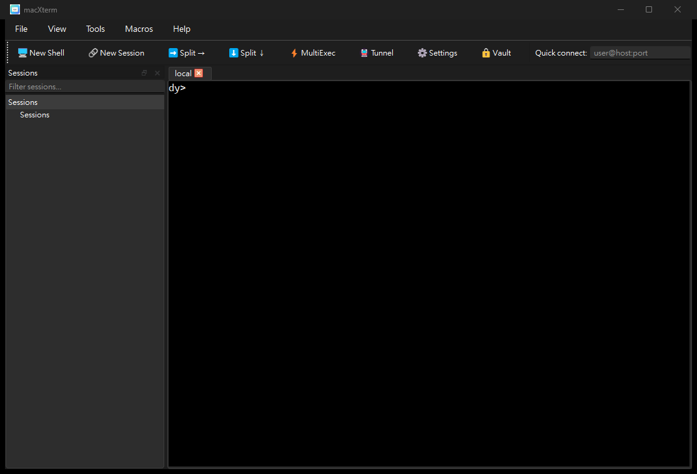
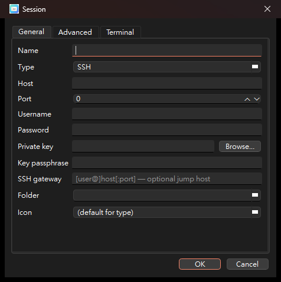

   
  <b>macXterm 完整使用說明書</b> 
  <i>Windows / macOS / Linux 通用 · 對應 2026-07 Windows 全功能版</i>

> 這份說明書針對**功能最完整的 Windows 版本**撰寫,涵蓋終端機、SSH/SFTP、通道、
> 遠端桌面、憑證保險庫、內建伺服器與網路工具。macOS / Linux 操作幾乎相同,平台差異
> 會特別標註。英文技術文件見 [USER_GUIDE.md](USER_GUIDE.md) 與 [DESIGN.md](DESIGN.md)。

---

## 目錄

1. [這是什麼、給誰用](#1-這是什麼給誰用)
2. [安裝與啟動](#2-安裝與啟動)
3. [主視窗導覽](#3-主視窗導覽)
4. [開啟工作階段的所有方式](#4-開啟工作階段session的所有方式)
5. [本機 Shell 與 PowerShell（重點）](#5-本機-shell-與-powershell重點)
6. [工作階段類型與欄位詳解](#6-工作階段類型與欄位詳解)
7. [SSH、SFTP、通道與跳板](#7-sssftp通道與跳板)
8. [終端機操作](#8-終端機操作)
9. [匯入既有工作階段](#9-匯入既有工作階段)
10. [憑證保險庫（含 Windows 帳號保護）](#10-憑證保險庫含-windows-帳號保護)
11. [內建工具與輕量伺服器](#11-內建工具與輕量伺服器)
12. [X11 轉發](#12-x11-轉發)
13. [設定](#13-設定)
14. [鍵盤快速鍵](#14-鍵盤快速鍵)
15. [Windows 專屬功能總覽](#15-windows-專屬功能總覽)
16. [疑難排解](#16-疑難排解)

---

## 1. 這是什麼、給誰用

macXterm 是一個 **MobaXterm 風格的遠端運算工具箱**:把分頁式終端機、SSH/SFTP、通道、
RDP/VNC 遠端桌面、X11 轉發、加密憑證保險庫,以及一整排網路工具與輕量伺服器,全部放在
**單一原生視窗**裡。以 Qt 6 + C/C++ 撰寫,同一份程式碼跑在 Windows / macOS / Linux。

**與 MobaXterm Home 版最大的不同:沒有任何人工上限** —— 儲存的工作階段、通道、巨集、
MultiExec 分割窗格、內建伺服器數量,通通不設限,而且是 MIT 授權、免費使用。

---

## 2. 安裝與啟動

### Windows

- **綠色可攜版**:解壓 `macXterm-portable.zip`,直接執行資料夾內的 `macXterm.exe`
  (Qt 執行檔庫已一併打包,免安裝)。
- **從原始碼建置**:見 [BUILD.md](BUILD.md) 的 Windows 章節(MSVC 2022 + Qt 6.8 + vcpkg;
  libvterm、libssh 需自行 vendor)。

啟動後會自動開一個**本機 shell 分頁**,可以立刻使用。

### macOS / Linux

見 [BUILD.md](BUILD.md);macOS 用 Homebrew 安裝相依套件後 `cmake` 建置,產生 `.app`。

---

## 3. 主視窗導覽

整個介面都在同一個視窗內(macOS 也一樣,選單列內嵌於視窗)。

由上到下、由左到右:

| 區域 | 說明 |
|------|------|
| **標題列圖示** | 左上角的終端機小圖示就是 macXterm 的 app icon。 |
| **選單列** | `File`(檔案)、`View`(檢視)、`Tools`(工具)、`Macros`(巨集)、`Help`(說明)。 |
| **工具列** | `New Shell` 開本機 shell、`New Session` 開新工作階段對話框、`Split →/↓` 分割窗格、`MultiExec` 廣播輸入、`Tunnel` 通道、`Settings` 設定、`Vault` 保險庫。 |
| **Quick connect** | 右上角輸入 `user@host:port` 直接快速連 SSH。 |
| **Sessions 樹（左側）** | 已存的工作階段書籤,可分資料夾、設圖示;上方 **Filter** 方塊即時過濾(依名稱/主機/使用者/資料夾)。右鍵有完整選單(編輯/改名/複製/移動/設圖示/複製 SSH 指令/刪除)。 |
| **分頁區（中央）** | 每個工作階段一個分頁(圖中 `local` 就是啟動時的本機 shell)。分頁可拖曳排序、卸下成獨立視窗。 |

---

## 4. 開啟工作階段（Session）的所有方式

| 方式 | 位置 | 用途 |
|------|------|------|
| **New Shell** 🖥️ | 工具列 / File 選單 | 立刻開系統預設本機 shell(Windows=cmd),**不經對話框、不能選 shell**。 |
| **New Session…** 🔗 | 工具列 / File 選單 | 開完整對話框,建立可儲存的書籤(SSH、Shell、RDP… 任何類型)。 |
| **New PowerShell Session** ⚡ | File 選單（僅 Windows） | **一鍵**開 PowerShell 分頁(優先 pwsh 7,否則 Windows PowerShell)。 |
| **New WSL Session…** 🐧 | File 選單（僅 Windows） | 列出已安裝的 WSL 發行版,選一個開啟。 |
| **New Local Unix Terminal** 🐚 | File 選單（僅 Windows） | 用內建 BusyBox 開類 Unix 終端機（需先放入 busybox.exe）。 |
| **Quick connect** | 工具列右上 | 輸入 `user@host:port` 直接連 SSH。 |
| **雙擊 Sessions 樹書籤** | 左側面板 | 開啟已儲存的工作階段。 |

---

## 5. 本機 Shell 與 PowerShell（重點）

Windows 上本機 shell 走 **ConPTY**,可以跑任何命令列程式(cmd、PowerShell、pwsh、
WSL、Git-Bash…)。有三種方式使用 PowerShell:

### 方式 A —— 一鍵(最推薦)

**File → ⚡ New PowerShell Session**。直接開一個 PowerShell 分頁,自動偵測 pwsh 7,
找不到才用 Windows PowerShell 5.x。完全不用碰對話框。

### 方式 B —— 用對話框選擇(可存成書籤)

1. **File → 🔗 New Session…**
2. 最上面 **Type** 選 **Shell**
3. 此時中間會出現 **Shell** 欄位 —— 它是「**可輸入的下拉框**」,**點最右邊的 ▾ 箭頭**
   會展開偵測到的清單:
   - `C:\Windows\System32\cmd.exe`
   - `C:\Windows\System32\WindowsPowerShell\v1.0\powershell.exe`
   - `…\pwsh.exe`（PowerShell 7）
   - Git-Bash（若有安裝）
   - 也可以**直接打字**填任何 shell 的完整路徑;**留空 = 預設(cmd)**
4. 按 **OK** 建立書籤,之後雙擊即可開啟。

> 💡 深色主題下下拉箭頭較不明顯,記得點欄位**右側**的 ▾。若嫌麻煩,用方式 A。

### 方式 C —— WSL

**File → 🐧 New WSL Session…** 會執行 `wsl.exe -l -q` 列出發行版,選定後以 ConPTY 開啟。

---

## 6. 工作階段類型與欄位詳解

**New Session** 對話框分成 **General / Advanced / Terminal** 三個分頁,只會顯示與所選
類型相關的欄位。

### General 分頁常見欄位

| 欄位 | 說明 |
|------|------|
| **Name** | 書籤顯示名稱。 |
| **Type** | 工作階段類型(見下表)。 |
| **Host / Port / Username** | 連線目標;本機 Shell 不需要。 |
| **Password** | 連線密碼(建議搭配保險庫,不會存明文)。 |
| **Private key / Key passphrase** | SSH 金鑰檔與其密語。 |
| **SSH gateway** | 跳板主機 `[user@]host[:port]`(SSH ProxyJump)。 |
| **Shell** | 僅 Shell 類型;選擇 cmd/PowerShell/pwsh 等(見第 5 節)。 |
| **Folder / Icon** | 書籤歸類資料夾與顯示圖示。 |

### 支援的 14 種類型

| 類型 | 說明 |
|------|------|
| **SSH** | 主力。密碼或金鑰認證;同一連線同時承載 SFTP、通道、X11。 |
| **Telnet / RSH / Rlogin** | 傳統遠端 shell 協定。 |
| **Serial** | 序列埠主控台(baud/data/parity/stop/flow,預設 9600 8N1)。 |
| **Mosh** | 漫遊友善的行動 shell(透過 SSH 啟動)。 |
| **SFTP** | 專用 SFTP 檔案瀏覽器(無終端機)。 |
| **FTP** | 圖形化 FTP 瀏覽器(被動模式)。 |
| **S3** | Amazon S3 儲存桶瀏覽器(SigV4 簽章)。 |
| **RDP** | 連 Windows 遠端桌面;Advanced 分頁可設解析度、剪貼簿/磁碟/音訊重導、NLA。 |
| **VNC** | 遠端畫面共享,滑鼠鍵盤全互動,可切唯讀。 |
| **XDMCP** | X 顯示管理器查詢啟動。 |
| **Browser** | 內嵌網頁瀏覽器。 |
| **Shell** | 本機 shell(見第 5 節)。 |

SSH 的 **Advanced** 分頁另有:壓縮、X11 轉發、agent 認證/轉發、keepalive 間隔、
「執行遠端指令而非登入 shell」、「指令結束後保留窗格」。

---

## 7. SSH、SFTP、通道與跳板

- **SSH**:填 Host/Username,密碼或金鑰認證即可連線。**Windows 上 SSH 走 Winsock**,
  與 macOS/Linux 功能相同。
- **SFTP 瀏覽器**:SSH 連上後自動可用;支援拖放傳輸、跟隨終端機目前目錄、雙擊遠端檔案
  就地編輯並自動回存、遞迴資料夾傳輸(可取消進度條)。
- **通道(Tunnel)** 🚇:工具列 `Tunnel`,支援 **本地 / 遠端 / 動態(SOCKS)** 三種,
  RDP/VNC 也可經由跳板路由。
- **跳板 / 堡壘機**:在工作階段設定 **SSH gateway**;匯入 `~/.ssh/config` 的 `ProxyJump`
  也會自動帶入。

---

## 8. 終端機操作

- **VT100/VT220/xterm** 模擬,256 色 **與 true-color**,emoji / 星平面字元、**CJK 輸入法
  (IME)** 打字、語法highlight、bracketed paste、滑鼠回報、捲動歷史搜尋、`Ctrl`/`Cmd`+點擊
  開啟 URL、resize 重排。
- **分頁與窗格**:拖曳排序、卸下/重新併入浮動視窗、**2/2/4 分割窗格**(工具列 `Split →/↓`)。
- **MultiExec** ⚡:把同一次按鍵**廣播到每個可見窗格**(工具列 `MultiExec`)。
- **右鍵選單**:複製/貼上、清除、搜尋等(含圖示)。

---

## 9. 匯入既有工作階段

**File** 選單提供多種匯入,不用重建連線:

| 來源 | 說明 |
|------|------|
| **~/.ssh/config** | OpenSSH 設定,每個 `Host` 區塊 → 一個 SSH 工作階段。 |
| **PuTTY** | Windows 讀登錄檔 `HKCU\…\SimonTatham\PuTTY\Sessions`;其他平台讀 `~/.putty/sessions`。 |
| **WinSCP** | Windows 讀 WinSCP 登錄檔;任何平台可指定 `WinSCP.ini`,依 FSProtocol 轉成 SFTP/FTP。 |
| **MobaXterm.ini / 共享工作階段** | 匯入 MobaXterm 匯出檔或 macXterm 的 `.mxsess`。 |

匯入的工作階段會歸到對應的「Imported (…)」資料夾。

---

## 10. 憑證保險庫（含 Windows 帳號保護）

工具列 **Vault** 🔒。密碼與金鑰密語**加密儲存**(AES-256-GCM + Argon2id/scrypt),
SQLite 只存參照、絕不存明文。

- **一般模式**:設一組主密碼,解鎖後工作階段密碼即以加密方式保存。
- **Windows 帳號保護(DPAPI)**:**建立新保險庫時**會詢問是否用你的 Windows 帳號綁定
  (`CryptProtectData`)——選是就**免主密碼**,在這台機器上以你的帳號自動解鎖。可攜式
  AES-GCM 密碼保險庫仍是預設,DPAPI 為選用。

---

## 11. 內建工具與輕量伺服器

**Tools** 選單 / 工具列 `Servers`,全部**沒有 Home 版的執行上限**:

- **Port scanner**、**Subnet sweep**(CIDR 掃描)、**Packet capture**(libpcap + 封包解碼)
- **Key generation**(SSH 金鑰,MobaKeyGen 風格)、**Image viewer**、**Text/Folder diff**
- **色彩配置編輯器**
- **輕量伺服器**:TFTP、HTTP GET、FTP(完整被動)、Telnet、CRON、**NFSv3(讀寫)**、
  **SSH/SFTP**(密碼認證 + PTY shell)——這些在 Windows 上也可用。
- **Remote monitor**:SSH 終端機下方顯示遠端即時 CPU / RAM / NET。

---

## 12. X11 轉發

macXterm 不自帶 X server,而是整合平台的 X server 並管理 `DISPLAY`:

- **macOS** → XQuartz  ·  **Linux** → 原生 X.Org  ·  **Windows** → **VcXsrv**

在 SSH 工作階段的 Advanced 分頁啟用 **X11 forwarding**。**Windows 上 macXterm 會自動
偵測 VcXsrv(TCP 6000)並在需要時幫你啟動**,設定 `DISPLAY=localhost:0.0`。之後在 SSH
內執行 GUI 程式,就會以本機視窗出現。`Ctrl+Shift+X` 可快速切換。

---

## 13. 設定

工具列 **Settings** ⚙️:

- **Terminal**:字型(含 Nerd Font fallback)、色彩配置、捲動歷史行數、Backspace 送出碼。
- **X11**:啟用 SSH X11 轉發、自動啟動 X server。
- 這些為全域預設;個別工作階段可在其 **Terminal** 分頁覆寫。

---

## 14. 鍵盤快速鍵

| 快速鍵 | 動作 |
|--------|------|
| `Ctrl+Shift+T` | 新增本機 shell 分頁 |
| `Ctrl+Shift+W` | 關閉目前分頁 |
| `Ctrl+Shift+X` | 切換 X11 轉發 |
| `Ctrl`/`Cmd`+點擊 | 開啟終端機中的 URL |

(完整清單見 Help 選單 / 設定。)

---

## 15. Windows 專屬功能總覽

以下項目在 Windows 版皆已實作:

- ✅ **ConPTY 本機 shell** + cmd/PowerShell/pwsh 選擇器
- ✅ **SSH / SFTP / 通道 / 動態 SOCKS**(Winsock)
- ✅ **X11 轉發**(自動啟動 VcXsrv)
- ✅ **WSL 工作階段**
- ✅ **PuTTY / WinSCP 匯入**
- ✅ **DPAPI 帳號綁定保險庫**
- ✅ **NFS 伺服器 · 內建 SSH/SFTP 伺服器**
- ✅ `cygpath` / `/drives` 路徑對應 + 本機 Unix 終端機啟動器
- ✅ **Windows 整合**：`macxterm:` 通訊協定 + `.mxtsession` 檔案關聯
  (**File → Register with Windows…**)

尚待打包的外部素材:內建 BusyBox 執行檔、程式碼簽章憑證。

---

## 16. 疑難排解

| 問題 | 解法 |
|------|------|
| **Shell 下拉看不到 PowerShell** | 那是「可輸入下拉框」,點欄位**右側 ▾**;或直接用 **File → ⚡ New PowerShell Session**。確認執行的是最新 `macXterm.exe`。 |
| **看不到 New PowerShell / WSL 選單** | 這些是 **Windows 專屬**選單項,且需執行含此功能的最新版本。 |
| **X11 程式開不出來** | 確認已安裝 VcXsrv;在 SSH Advanced 啟用 X11 forwarding(macXterm 會嘗試自動啟動 VcXsrv)。 |
| **SSH 連不上** | 檢查 Host/Port/認證;Windows 上 SSH 已走 Winsock,功能與其他平台相同。 |
| **保險庫忘記主密碼** | 無法還原(設計上不留後門);可刪除保險庫檔重建。Windows 可改用 DPAPI 免密碼模式。 |
| **啟動缺 DLL** | 用可攜版整包執行,或以 `windeployqt` 佈署 Qt 執行檔庫(見 BUILD.md)。 |

---

<i>祝使用愉快 —— 一個視窗搞定 shell、遠端連線、檔案、通道與網路工具。</i>

